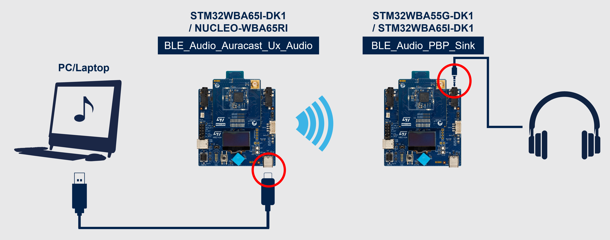
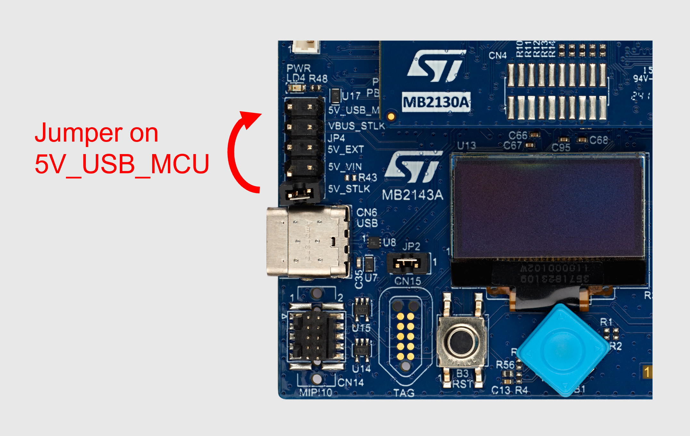

# BLE_Audio_Auracast_Ux_Audio

The objective of this project is to provide examples of the implementation of the USB Class Audio using the Azure RTOS USBX stack on the STM32WBA6 MCU.

The BLE_Audio_Auracast_Ux_Audio application streams stereo audio from USB to Auracast stream.
 

### __Keywords__

Connectivity, BLE, BLE protocol, BLE Audio, Bare Metal, Auracast&reg, USB, USB Class Audio

### __Hardware and Software environment__

This example runs on **STM32WBA65I-DK1** boards.

To build the projects, you need one of the following IDE:
  - IAR Embedded Workbench for ARM (EWARM) 9.60.3
  - STM32CubeIDE 2.2.0

> [!WARNING]
> Using STM32CubeIDE in **Debug** configuration can cause audio glitches due to GCC optimization for this debug. Consider using the **Release** configuration when not debugging, or use IAR.

### __How to use it?__
The following materials are needed to replicate the demo:
  - An **STM32WBA65I-DK1** running this project
  - An **STM32WBA55-DK1** or an **STM32WBA65I-DK1** running the BLE_Audio_PBP_Sink project available in the [STM32CubeWBA firmware package](https://www.st.com/en/embedded-software/stm32cubewba.html)
  - A USB Class Audio host: any PC or smartphone
  - A USB cable to connect the Discovery Kit to the USB host (usually a USB-A to USB-C cable for PC and USB-C to USB-C for smartphone)
  - Headphones with a 3.5mm jack input

The following diagram details how to set up the demo:

    

To power the Discovery Kit from the USB and not the ST-Link, move the jumper to "5V_USB_MCU":

    

### __Variant__
The define DEMO_STEREO can be removed at application level and replaced by DEMO_4_LANGUAGES. 
For this variant, the USB host recognizes the device as a 4 channel audio peripheral, each channel is mapped to a dedicated BIS contained in a dedicated subgroup. 
Thus, a multi language file can be streamed.
The sink must be adapted to support 4 subgroups and synchronize the expected one. Note the broadcast name is has been changed to ***STM32Language_1***

Note that the device may need to be manually uninstalled from the device manager to clear cached configuration. 

### __Documentation__

   - Wiki pages related to the LE Audio solutions developped by STMicroelectronics are available here:
     - <a href="https://wiki.st.com/stm32mcu/wiki/Connectivity:Introduction_to_Bluetooth_LE_Audio"> Introduction to Bluetooth® Low Energy Audio</a>
	 - <a href="https://wiki.st.com/stm32mcu/wiki/Connectivity:Bluetooth_LE_Audio_-_STM32WBA_LC3_Codec"> Bluetooth® Low Energy audio - STM32WBA LC3 codec and audio data path</a>
     - <a href="https://wiki.st.com/stm32mcu/wiki/Connectivity:Bluetooth_LE_Audio_-_STM32WBA_Architecture_and_Integration"> Bluetooth® Low Energy audio - STM32WBA Architecture and Integration</a>
     - <a href="https://wiki.st.com/stm32mcu/wiki/Connectivity:Bluetooth_LE_Audio_-_Content_Control"> Bluetooth® Low Energy audio - Content Control</a>
     - <a href="https://wiki.st.com/stm32mcu/wiki/Connectivity:Bluetooth_LE_Audio_-_STM32WBA_Public_Broadcast_Profile"> Bluetooth® Low Energy audio - STM32WBA Public broadcast profile</a>

   - Wiki page related to the USBX implementation on STM32 is available here:
     - <a href="https://wiki.st.com/stm32mcu/wiki/Introduction_to_USBX"> Introduction to USBX</a>