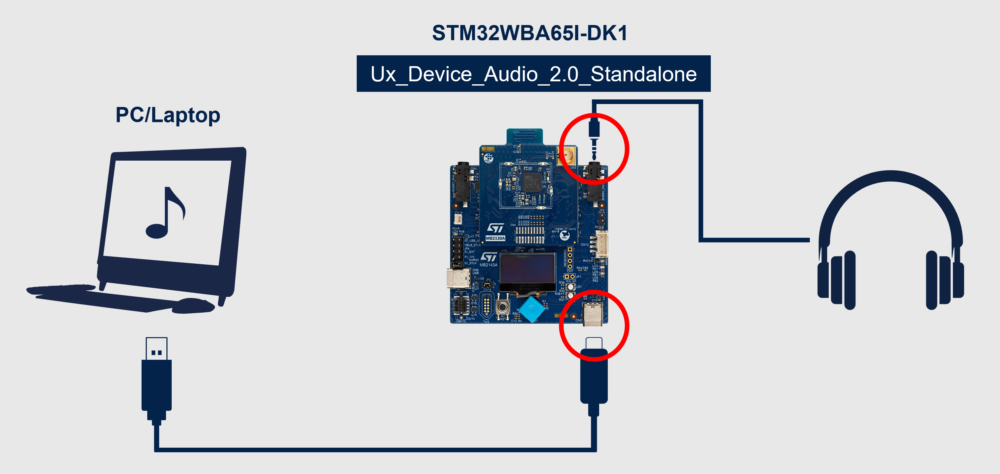
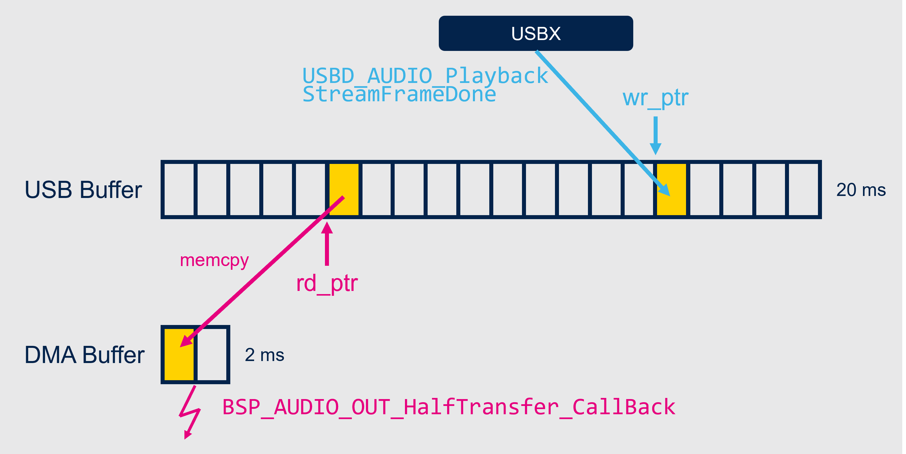
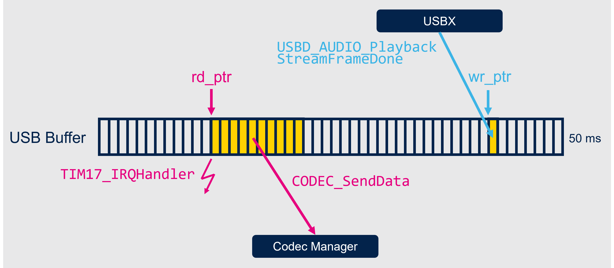

# STM32WBA6 USBX Class Audio

The objective of this project is to provide examples of the implementation of the USB Class Audio using the Azure RTOS USBX stack on the STM32WBA6 MCU.

Two different projects are available in this repository:
 * [**Ux_Device_Audio_2.0_Standalone**](#ux_device_audio_20_standalone) runs on **STM32WBA65I-DK1** and implements USB Class Audio using USBX in Standalone mode (without Azure RTOS). The audio received by USB is rendered on the 3.5mm jack output of the Discovery Kit through SAI.
 * [**BLE_Audio_Auracast_Ux_Audio**](#ble_audio_auracast_ux_audio) runs on both **STM32WBA65I-DK1** and **NUCLEO-WBA65RI** and implements USB Class Audio using USBX in Standalone mode, along with a Auracast™ Source using the Bluetooth® LE Audio library from STMicroelectronics.

## Table of content
* **[Ux_Device_Audio_2.0_Standalone](#ux_device_audio_20_standalone)**
  * **[Setup](#setup)**
  * **[Pictograms](#pictograms)**
  * **[Software Data Architecture](#software-data-architecture)**
* **[BLE_Audio_Auracast_Ux_Audio](#ble_audio_auracast_ux_audio)**
  * **[Pictograms (STM32WBA65I-DK1)](#pictograms-stm32wba65i-dk1)**
  * **[LEDs (NUCLEO-WBA65RI)](#leds-nucleo-wba65ri)**
  * **[Software data architecture](#software-data-architecture-1)**
* **[USBX Standalone Porting](#usbx-standalone-porting)**
* **[Clock Synchronization](#clock-synchronization)**

## Ux_Device_Audio_2.0_Standalone

This example runs on the **STM32WBA65I-DK1** board.

To build the projects, you need one of the following IDE:
  * IAR Embedded Workbench for ARM (EWARM) 9.20.1
  * STM32CubeIDE 1.18.0

### Setup
The following materials are needed to replicate the demo:
 * An **STM32WBA65I-DK1** running the Ux_Device_Audio_2.0_Standalone project
 * A USB Class Audio host: any PC or smartphone
 * A USB cable to connect the Discovery Kit to the USB host (usually a USB-A to USB-C cable for PC and USB-C to USB-C for smartphone)
 * Headphones with a 3.5mm jack input

The following diagram details how to set up the demo:

    

To power the Discovery Kit from the USB and not the ST-Link, move the jumper to "5V_USB_MCU":

    

### Pictograms
During the runtime of the Ux_Device_Audio_2.0_Standalone app on **STM32WBA65I-DK1**, the following pictograms are displayed on the LCD screen to indicate the current status of USB:
| Logo         | Meaning                                  |
|:---------    |:----------                               |     
|      | USB is disconnected                      |
|  | USB is connected, audio is not streaming |
|  | USB is connected, audio is streaming     |

### Software Data Architecture
The Ux_Device_Audio_2.0_Standalone application works with two rolling buffers:
 * A USB buffer of 20ms `BufferCtl.buf`
 * An audio DMA buffer of 2ms `DMABuffer`

The USB buffer is fed with data from the USBX stack callback `USBD_AUDIO_PlaybackStreamFrameDone`. `BufferCtl.wr_ptr` keeps the current write position and resets to zero once it reaches the end of the buffer.

The audio DMA buffer is used by the audio BSP of the STM32WBA65I-DK1 to send data to the audio codec. `BSP_AUDIO_OUT_HalfTransfer_CallBack` and `BSP_AUDIO_OUT_TransferComplete_CallBack` are called when the DMA reaches the half and the end of the buffer. At this point, the half buffer completed is safe to write and can be filled with data from the USB Buffer, using the read pointer `BufferCtl.rd_ptr`.

The 10ms between the write and the read pointers are used to ensure that clock drift doesn't cause overlap between the samples read and written. Refer to the [Clock Synchronization](#clock-synchronization) section for more details.

## BLE_Audio_Auracast_Ux_Audio

This example runs on **STM32WBA65I-DK1** and **NUCLEO-WBA65RI** boards.

To build the projects, you need one of the following IDE:
  * IAR Embedded Workbench for ARM (EWARM) 9.20.1
  * STM32CubeIDE 1.18.1

> [!WARNING]
> Using STM32CubeIDE in **Debug** configuration can cause audio glitches due to GCC optimization for this debug. Consider using the **Release** configuration when not debugging, or use IAR.

### Setup
The following materials are needed to replicate the demo:
 * An **STM32WBA65I-DK1** or a **NUCLEO-WBA65RI** running the BLE_Audio_Auracast_Ux_Audio project
 * An **STM32WBA55-DK1** or an **STM32WBA65I-DK1** running the BLE_Audio_PBP_Sink project available in the [STM32CubeWBA firmware package 1.6.1](https://www.st.com/en/embedded-software/stm32cubewba.html)
 * A USB Class Audio host: any PC or smartphone
 * A USB cable to connect the Discovery Kit to the USB host (usually a USB-A to USB-C cable for PC and USB-C to USB-C for smartphone)
 * Headphones with a 3.5mm jack input

The following diagram details how to set up the demo:

    

To power the Discovery Kit from the USB and not the ST-Link, move the jumper to "5V_USB_MCU":

    

### Pictograms (STM32WBA65I-DK1)
During the runtime of the BLE_Audio_Auracast_Ux_Audio app on **STM32WBA65I-DK1**, the following pictograms are displayed on the LCD screen to indicate the current status of USB and Auracast:
| Logo         | Meaning                                  |
|:---------    |:----------                               |     
|      | USB is disconnected                      |
|       | USB is connected, audio is not streaming |
|  | USB is connected, audio is streaming     |

| Logo         | Meaning                                             |
|:---------    |:----------                                          |     
|      | Auracast is starting                                |
|       | Auracast Source established, audio is not streaming |
|  | Auracast Source established, audio is streaming                 |

### LEDs (NUCLEO-WBA65RI)
During the runtime of the BLE_Audio_Auracast_Ux_Audio app on **NUCLEO-WBA65RI**, the following LED indicators show the current status of USB and Auracast:
| Green LED  |         | Meaning                                  |
|:---------|:---------    |:----------                               |     
|  | Off   | USB is disconnected                      |
|  | Static     | USB is connected, audio is not streaming |
|  | Blinking | USB is connected, audio is streaming     |

| Blue LED  |         | Meaning                                  |
|:---------|:---------    |:----------                               |   
|  | Off   | Auracast is starting                                |
|  | Static     | Auracast Source established, audio is not streaming |
|  | Blinking | Auracast Source established, audio is streaming  |

### Software data architecture
The BLE_Audio_Auracast_Ux_Audio application works with a single 50 milliseconds buffer `BufferCtl.buf`. It retrieves data from the USBX stack during the `USBD_AUDIO_PlaybackStreamFrameDone` callback using the `BufferCtl.wr_ptr` pointer as the destination in the buffer.

At the start of the USB audio streaming, the general-purpose timer peripheral `TIM17` is started to ring every 10ms, with a clock based on the radio PLL to ensure it's able to feed data to the codec at each SDU interval of the Broadcast Isochronous Stream. The 10ms frame is then sent using the `CODEC_SendData` API.

The 50ms buffer size is chosen to ensure that there is around 20ms before and after the buffer to send to the codec and the write pointer. This way, we ensure that that clock drift doesn't cause overlap between the sample read and written. Refer to the [Clock Synchronization](#clock-synchronization) section for more details.

## USBX Standalone Porting
The USBX stack from Microsoft Corporation is originally developed to work with Azure RTOS. However, it includes a build option to make it independent from an OS: `UX_STANDALONE`.
Using this option requires manually running the task `ux_device_stack_tasks_run`, usually in background. No information is provided on when exactly this function must be run so it's generally ran constantly in USB only applications.

Due to the nature of the BLE_Audio_Auracast_Ux_Audio application, which runs the Bluetooth® Low Energy stack in addition to the USBX stack, the use of a sequencer is required, and we need to run the USBX stack only when necessary. After some experimentation, it has been established that the `ux_device_stack_tasks_run` needs to run two times during USB interrupts to allow packets to be processed correctly. The task is run in interrupt context, to avoid preemption by heavy tasks like the LC3 encoding. This architecture has been replicated in the Ux_Device_Audio_2.0_Standalone app for cohesion.

In summary, `USB_OTG_HS_IRQHandler` runs the USBX task `ux_device_stack_tasks_run` two times, which is sufficient for the USBX process to work correctly and leave CPU time for other processes.

## Clock Synchronization

A USB audio device is usually dependent on two different clocks:
 * The USB clock, controlled by the USB host
 * The Audio output clock, controlled by the device itself

In these examples, the audio output clock is a PLL that handles either the Audio DMA or the Radio.
 
These two clocks will eventually drift from one another, which will cause either too many or too few packets coming from the USB for the Audio Output pace. To avoid glitches in the resulting audio, a clock drift compensation mechanism must be integrated.

The USB Specification introduces a mechanism called **Explicit Feedback**, which permits a USB Audio Device to send feedback to the host about the actual sample rate calculated relative to the audio output clock. An **IN** endpoint of size 4 must be added to the descriptor with the type *Isochronous* and *Feedback*. In addition, the isochronous **OUT** endpoint must use the *Asynchronous* type. During the USB audio streaming, the USB audio device will regularly evaluate the sample rate feedback value and send it to the host through the endpoint. The host should then adjust the number of packets sent each USB events to match the audio output pace of the device. For more details about this mechanism, refer to the [USB 2.0 specification](https://www.usb.org/document-library/usb-20-specification).

In Ux_Device_Audio_2.0_Standalone, the feedback value is evaluated during the reception of the USB audio frame `USBD_AUDIO_PlaybackStreamFrameDone` based on the difference between `BufferCtl.wr_ptr` and `BufferCtl.rd_ptr`.

In BLE_Audio_Auracast_Ux_Audio, the feedback value is evaluated after sending data to the codec in `APP_NotifyFrameCplt` and is also based on the difference between `BufferCtl.wr_ptr` and `BufferCtl.rd_ptr`.

> [!WARNING]
> Some smartphones seem to not correctly handle the explicit feedback feature, although it should be mandatory for any USB Host.
> The following smartphones were tested and found **not compatible** with explicit feedback:
> * Google Pixel 6, 7 and 8
> * Sony Xperia V 5